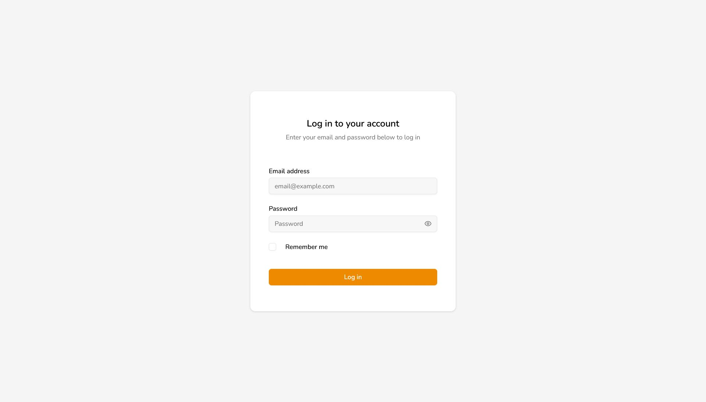
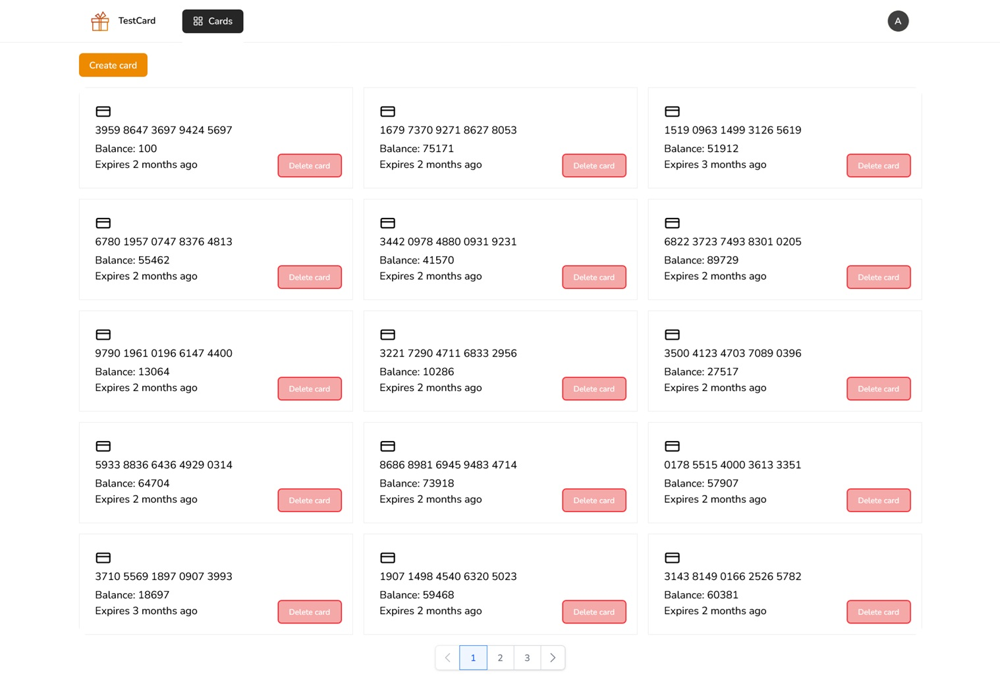
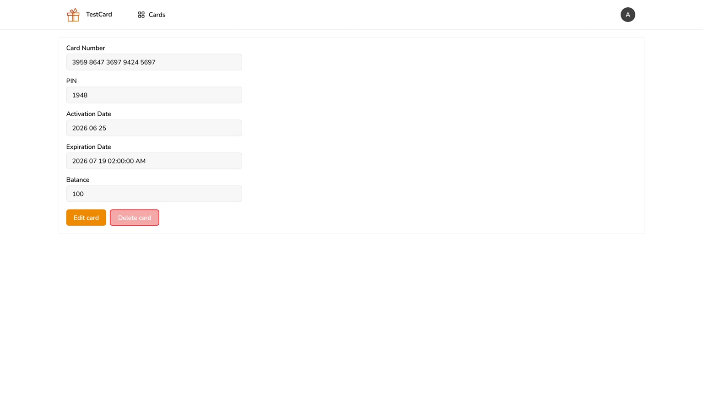
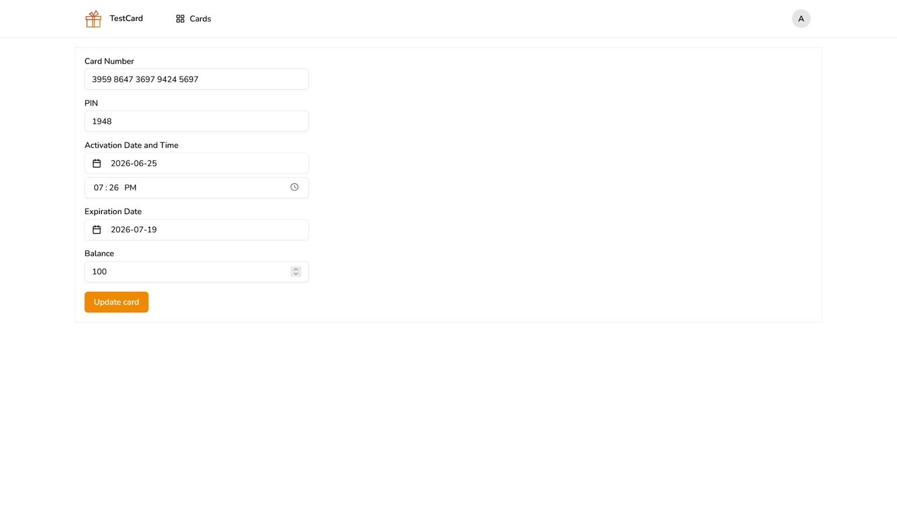
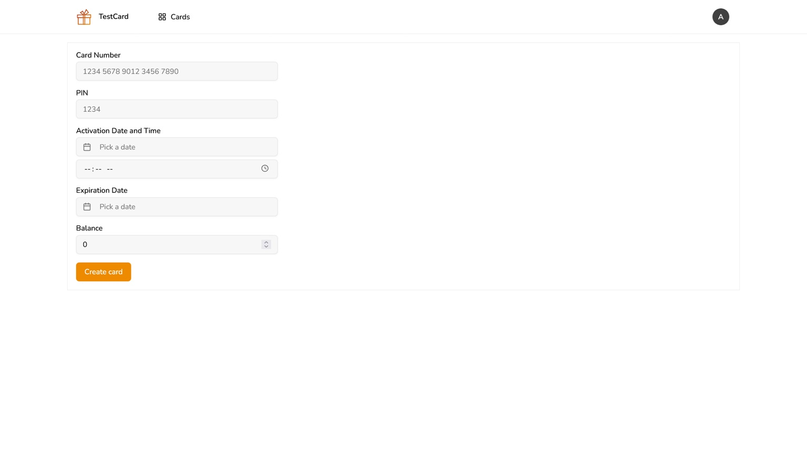
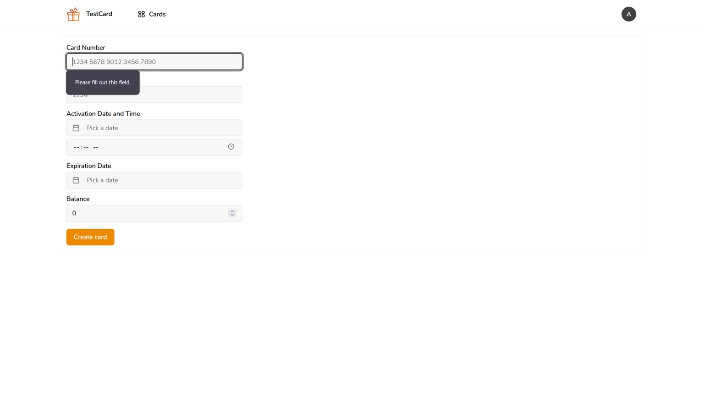
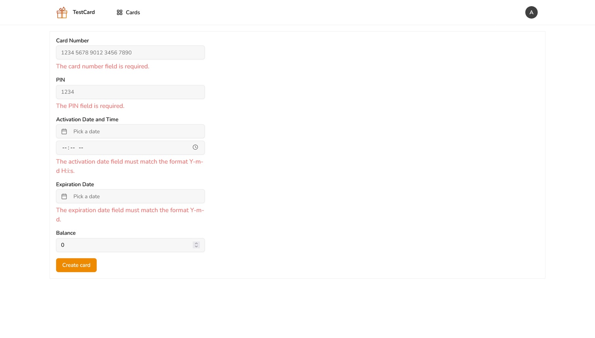

<!--
  - README.md
  -->

<h1>This project is a solution to a problem of: how to build a CRUD application</h1>

<h2>What the views/pages look like & how to use them</h2>

<h3>Login View</h3>

<i>Login View: when visiting the website for the first time</i>

<strong>Below you can find a link and default credentials to check out a working version of this solution:</strong>

[kacmal.pl/testcard](https://kacmal.pl/testcard) (note: hold [CTRL] + click with the mouse -> this way it will open in a new tab instead of opening in this one. 

Email address: admin@localhost  

Password: phplaravel

<strong>There is only one account the "Admin" who can perform all the CRUD functions (Create, Read, Update and Delete) on some resources of interest.</strong>

<h3>Resources Overview Page</h3>

<i>Resources Overview Page: also knows as the "Index View of the Resources"</i>

First thing we're greeted with after login in is an overview of all our resources.  

A single resource this project stores in a database is a virtual gift card that is identified by a unique card number and some other details.  

This is actually an instance of the Read functionality from the CRUD suite as we're effectively reading information from the database (forcing a <code>SELECT</code> statement).  

We can also see a [Delete] button floating over each card and we will see it later on in a detailed view of a single card page.

<h3>Show View</h3>

<i>Show View: here we can see all the details about a singular resource</i>

So after clicking on one of the cards listed in the index view we're now shown all of its context data (well, almost all of it as some things stored in a database are treated as meta-information and are seldom displayed in the browser -> things like the "id" attribute that is just used internally by the application).  

Aside from the Read functionality this page offers we can also Delete the selected resource. Mind you, a deletion should NEVER be the primary button and should never be focused once a page loads since it is a destructive functionality. Best is to add an extra confirmation button that will ask the user if they "really mean it" and that they "understand it is irreversible".  

Of course sometimes a [Delete] is reversible like with the so-called "soft deletions" where a resource is put into trash or is hidden away from the user's view. It is still good to add a confirmation button especially that modern browsers offer built-in solutions like the <code>window.confirm</code> function and the HTML5 <code>&lt;dialog&gt;</code> tag.

<h3>Edit View</h3>

<i>Edit View: an extended version of the Show View where we can save the edited changes</i>

I will admit that the original Show View shouldn't use the <code>&lt;input&gt;</code> tags to display data to the user because it can be mistakenly altered. However I wanted to test a way to make the two views as indistinguishable from one another as I could to compare with what I already knew about the standard design of the show and edit pages. For me the challenge was to accommodate the same amount of space for each displayed data in both views so that the page doesn't feel too unintuitive in the editing mode.  

To summarize, I like when an editing view looks very similar to the showing view and I was wondering if that could be achieved with the <code>&lt;input&gt;</code> tags.  

Turned out the user can mistakenly start editing the fields only to find out that it's just a presentation view and also to prevent it as a developer you cannot just set the <code>user-select: none;</code> CSS attribute since then the user cannot copy any data from the page. A much more reasonable approach would be setting the <code>readonly</code> attribute on the HTML elements itself.  

Let me just add one more interesting fact about the CRUD applications. And it is that the Update functionality is not directly implemented through the Edit View. The actual update is performed as a POST HTTP request sent to the web server that ultimately updates a database record. The Edit View is just auxiliary to the Update functionality so that the user can have some form of an interface to request it. 

<h3>Create View</h3>

<i>Create View: a way for our application to populate the database with resources</i>

If we go back to the Index View we will see in the top left corner a [Create] button that redirects to this page.  

It feels like the right moment to talk about the validation functionalities of the application. We have to understand that a user should be "assumed guilty until proven innocent" since nothing stops us from inputting letters into a card number field that expects digits and optional spaces.

 | 
:---: | :---:
<i>Client-Side Validation</i> | <i>Server-Side Validation</i>

Here we can see a crucial distinction between a client-side vs server-side validation. In the former we can optimize user request processing with respect to handling the errors before they are sent to us over the internet. However, this method is fallible as a tech-savvy user can disable the browser security measures. In the latter example we perform the data processing on the web server and return error messages to the user if such errors should occur.
